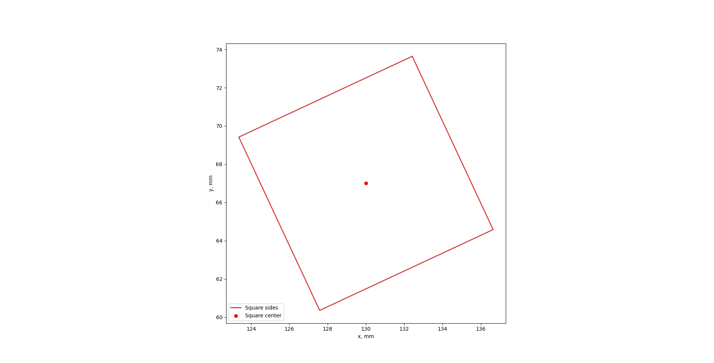
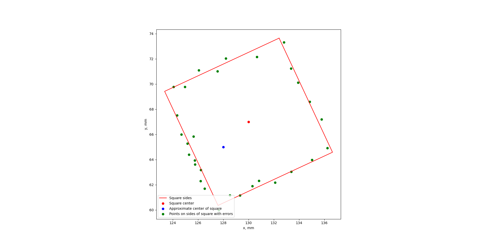
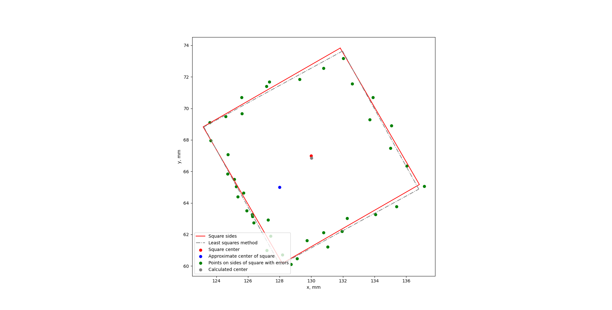

# search_for_square
Скрипт для вычисления расположения квадрата методом наименьших квадратов.

## Описание задачи

Имеется квадрат, известна длина **L** его стороны. На плоскости квадрат расположен не точно вдоль осей **X** и **Y**.



Известно примерное положение центра квадрата. Из данного центра можно провести **N** лучей и найти примерные точки пересечения этих лучей со сторонами квадрата.



Задача состоит в вычислении оптимального положения квадрата заданной длины, если известно примерное расположение точек на сторонах квадрата.

## Описание решения

Через стороны квадрата проходят прямые линии. Уравнение прямой имеет вид:

```
a * x + b * y + c = 0
```

У квадрата четыре стороны, потому есть 12 неизвестных коэффициентов:

- **a_1**, **b_1**, **c_1**;
- **a_2**, **b_2**, **c_2**;
- **a_3**, **b_3**, **c_3**;
- **a_4**, **b_4**, **c_4**.

Противоположные стороны квадрата параллельные. Пусть параллельными будут стороны 1 и 3, 2 и 4. Тогда:

```
a_1 = a_3, b_1 = b_3
a_2 = a_4, b_2 = b_4
```

Смежные стороны квадрата перпендикулярные. Потому:

```
a_1 * a_2 + b_1 * b_2 = 0 ->
b_2 = -a_1 * a_2 / b_1
```

Расстояние между параллельными прямыми вычисляется по формуле:

```
L = |c_3 - c_1| / sqrt(a_1**2 + b_1**2) ->
c_3 = c_1 + L * sqrt(a_1**2 + b_1**2)
```

Аналогично:

```
c_4 = c_2 + L * sqrt(a_2**2 + b_2**2)
```

В итоге неизвестными остаются коэффициенты: **a_1**, **b_1**, **c_1**, **a_2**, **c_2**.

Сумма расстояний любой точки внутри квадрата до всех сторон квадрата равна **2L**. Пусть задан какой-то квадрат с помощью набора коэффициентов **a_1**, **b_1**, **c_1**, **a_2**, **c_2**. Вычислим сумму расстояний от точки **i** до всех сторон данного квадрата и обозначим ее как **S_i**. Для нахождения оптимального квадрата нужно минимизировать величину **|S_i - 2L|**.

Пример работы нахождения оптимального квадрата по примерному расположению точек на его сторонах показан ниже.



## Запуск скрипта

1. Установите необходимые зависимости:

   ```bash
   python -m pip install --upgrade pip
   python -m pip install -r requirements.txt
   ```

2. Запустите скрипт:

   ```bash
   python square.py
   ```

   
